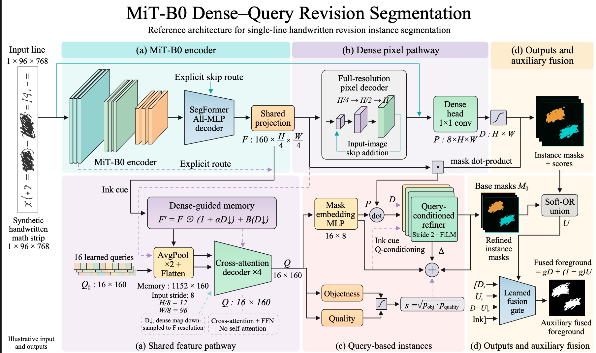
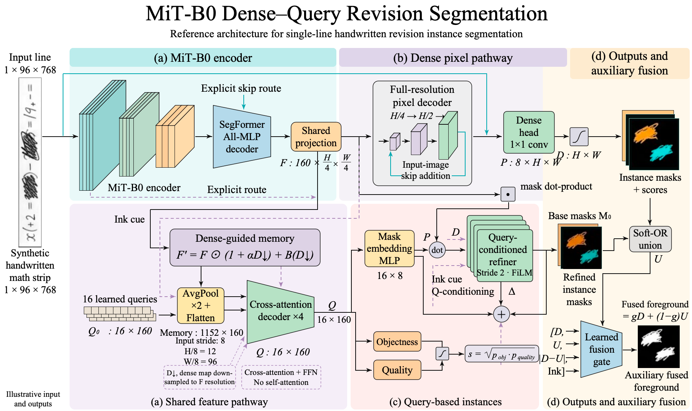
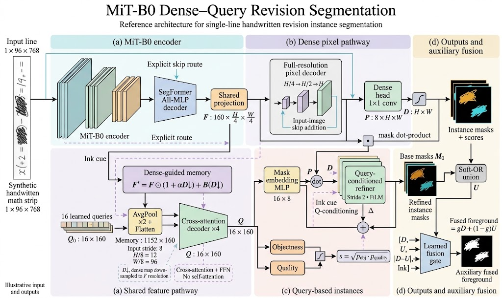

# Paper Diagram

**面向 LLM、机器学习和计算机视觉的可编辑论文架构图绘制与复刻。**

给 Agent 一张参考图，说一句：**「帮我复刻这张图」**。Paper Diagram 提供结构拆分、绘图代码、分组导出与参考图检查流程，输出可编辑的 SVG 和 PowerPoint。也支持根据模型描述绘制新图。

这是一个 **Agent skill + 本地 Python 工具包**。Agent 负责理解图像，代码负责记录几何、文字、分组和导出；不需要购买本项目的 API Key，也不调用付费矢量化服务。运行 Agent 本身仍使用所选平台的正常额度。

## 同一张图，有无本项目 skill 的对比

下面按 **使用 skill → 未使用本项目 skill → 原始参考图** 展示用户提供的截图。点击图片可以查看大图。

### ① 使用 Paper Diagram 的前身 cell-local



[下载可编辑 PPTX](examples/mit-b0/with-paper-diagram.pptx)

### ② 未使用本项目 skill，使用通用 PPTX 工具



[下载可编辑 PPTX](examples/mit-b0/without-paper-diagram.pptx)

### ③ 原始参考图



两种方法都能表达大部分模型结构。这个案例可重点比较编码器的叠层、查询块的配色、公式排版、连线和局部间距；打开 PPTX 还能检查对象是否可以成组移动。

| PPTX 内部对象 | 使用本项目 skill 的前身 | 未使用本项目 skill |
| --- | ---: | ---: |
| 原生形状 `p:sp` | 280 | 285 |
| 含文字的形状（上述形状的子集） | 111 | 76 |
| 分组 `p:grpSp` | 92 | 0 |
| 图片对象 `p:pic` | 0 | 4 |

**这些数量说明编辑结构，不是准确率。** 无图片对象也不代表每个轮廓都是语义对象。对照组使用了通用 Presentations skill / PPTX 工具，没有使用本项目的 cell-local；不能称为「完全没有任何 skill」。这是一次历史案例，未经控制模型、提示词和渲染环境的严格实验，不据此承诺所有图片都能精确 1:1 复刻。截图由用户提供；当前发布版包含后续改进，未用它重新生成此案例。[案例记录与文件校验值](examples/mit-b0/README.md)。

## 安装

需要 Python 3.10 或更高版本，以及能读取本地 skill、执行 Python 和查看图片的 Agent。以下为 Codex 的便携安装方式：

```sh
git clone https://github.com/Zsh123456-BOOP/paper-diagram.git
cd paper-diagram
python3 install_skill.py --copy
python3 -m venv "$HOME/.codex/skills/paper-diagram/runtime/.venv"
"$HOME/.codex/skills/paper-diagram/runtime/.venv/bin/python" -m pip install "$HOME/.codex/skills/paper-diagram/runtime[qa]"
```

若配置了自定义 `CODEX_HOME`，将后两条命令中的安装路径相应调整。Windows 使用 `python` 和虚拟环境的 `Scripts/python.exe`。安装器遇到同名 skill 会停止，避免覆盖已有文件。

也可以从 [Releases](https://github.com/Zsh123456-BOOP/paper-diagram/releases) 下载便携包，将整个 `paper-diagram` 文件夹放入 skill 目录，再在其中的 `runtime` 安装依赖。**不要只复制 SKILL.md**：脚本、参考说明、模板与 runtime 需要一起移动。

其他兼容 Agent 可以用 `python install_skill.py --copy --destination /your/skills-directory` 指定目录。工作流能移植，自动发现方式取决于宿主。重开任务以加载新 skill；需要明确指定时使用：

```text
使用 $paper-diagram，帮我复刻这张图。
```

附上参考图即可；也可以补充「所有矩阵单元和数字都要可编辑」「保留照片，其他部分重绘」或「根据下面的模型描述画结构图」。

## 如何工作

1. **识别与记录**：Agent 从参考图独立记录画布、标签、模块、公式、箭头和复杂素材，冻结参考快照。
2. **按含义拆分**：文字保持为文字；矩阵按单元格与数值分组；模块、箭头、叠层分别构建；不默认把每个像素色块都变成一个对象。
3. **代码绘制**：使用 Scene/SVG 绘制几何，必要时对不规则轮廓做局部拟合或描摹。照片可明确保留为图片，不把抠图说成重绘。
4. **导出与核对**：导出 SVG、原生分组 PPTX；渲染最终文件，检查字形位置、箭头、遮挡和分区差异，将报告绑定到实际交付文件。

参考图复刻默认**不需要 Image Generation 重绘**。像素差异检查能帮助发现偏移、断线和遗漏，但不能证明科学内容正确，也不能替代目视检查。当前流程需要 Agent 执行，不是一个脱离模型就能自动识别所有图的转换器。

## 适用范围与边界

- 擅长：模型架构图、训练流程、Attention/Transformer 模块、CNN 特征图叠层、矩阵、损失连接、数据流与多分支布局。
- 复杂公式、极小标签、交叉细线、字体替换仍需要局部检查；几何中心与文字视觉中心可能不同。
- 照片、显微纹理和复杂封面不保证全部转为有意义的可编辑对象；高保真描摹可能产生很多轮廓。
- 原生路径可以编辑，但不是会自动吸附和重连的 PowerPoint 智能连接线。SVG/PPTX 导出支持的是明确的子集，不支持的效果应报出或显式近似。
- SVG 可在 Illustrator 中继续编辑；本项目不提供原生 AI/PSD 导出，也不要求安装 Adobe。检查 PPTX 最终外观需要 PowerPoint、LibreOffice 等可用渲染器，字体需由使用者提供。

## 开发与验证

```sh
python3 -m venv .venv
.venv/bin/python -m pip install -e '.[qa,structure,preview]'
.venv/bin/python -m unittest discover -s tests
.venv/bin/python tools/build_release.py
```

[SKILL.md](skills/paper-diagram/SKILL.md) 是 Agent 的入口；[便携 Scene 说明](skills/paper-diagram/references/portable-scenes.md)介绍构图和导出；[参考图证据说明](skills/paper-diagram/references/reference-evidence.md)介绍冻结、比较与文件绑定。内部 Python 包名 `cell_local` 与旧命令别名保留，便于兼容已有工具。

录屏用的逐步绘制演示尚未实现，后续再设计。

## 开源许可与来源

代码采用 [MIT License](LICENSE)。项目从 cell-local 整理而来；传统 SVG → PPTX 路线使用了 [yrui-cmd/cell_su7](https://github.com/yrui-cmd/cell_su7) 的部分 MIT 离线导出代码，保留了来源、固定提交和许可证，详见 [THIRD_PARTY_NOTICES.md](THIRD_PARTY_NOTICES.md)。不包含其在线服务客户端、API Key 管理或余额功能。

---

**English:** Paper Diagram is an agent-assisted skill for editable ML, LLM and CV architecture diagrams. It combines reference interpretation, semantic grouping, local SVG/PPTX export and visual checks. No paid vectorization API is required. The example above is a historical comparison, not a controlled benchmark or a guarantee of pixel-perfect reproduction.
